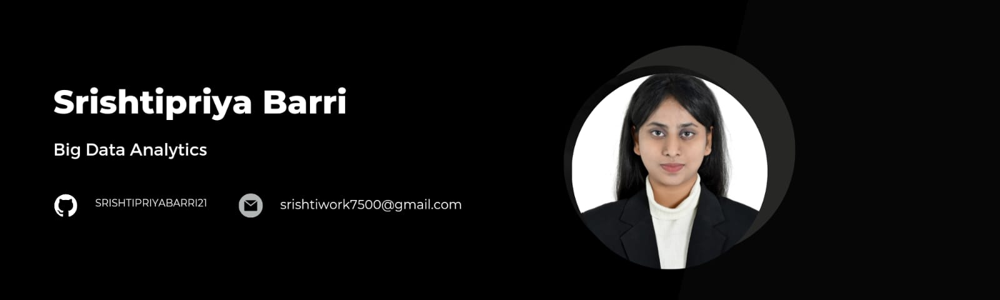
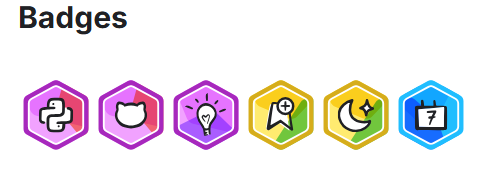

# What’s up, friend?

I am Srishtipriya 🙋🏻‍♂️(She/Her) 
 
I am B. Srishtipriya, a 23-year-old Big Data Analyst. I am passionate about leveraging data-driven insights to solve complex problems and enhance decision-making processes. Alongside my technical pursuits, I am also a dancer, blending creativity and discipline into both my personal and professional life.

I bring a dynamic mix of leadership, technical expertise, and innovation to every project I undertake. I am actively involved in innovative projects across domains such as Artificial Intelligence, Machine Learning, and Data Engineering, constantly pushing boundaries to deliver impactful solutions.

My technical expertise encompasses a broad spectrum, including DSA, SparkSQL, statistical modeling, ML/DL methodologies, Hadoop, AWS, Azure, and Databricks. I possess extensive experience in root cause analysis, data pipeline development, SQL/NoSQL databases, data marts, lakes, warehouses, and data governance frameworks. Furthermore, I am adept in data visualization using Power BI and Tableau, GLMM, multivariate statistical analysis, and Agile Scrum practices.

My core focus lies in devising scalable big data solutions, conducting comprehensive exploratory data analysis (EDA), and uncovering actionable insights through data discovery. I warmly invite you to explore my portfolio and provide your valuable feedback on my projects.  

## My [Portfolio](https://portfolio-srishtipriya.onrender.com) and Skills

 

  Check out my projects and delve into an array of resources.    
  
  

# Connect and Collaborate 🚀

  
  
  

<!-- Markdown -->
